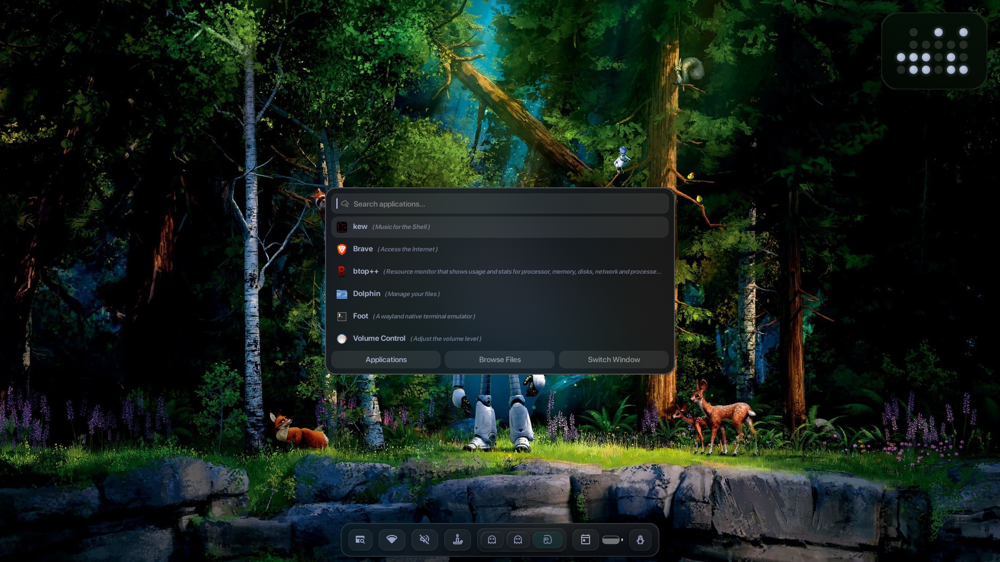
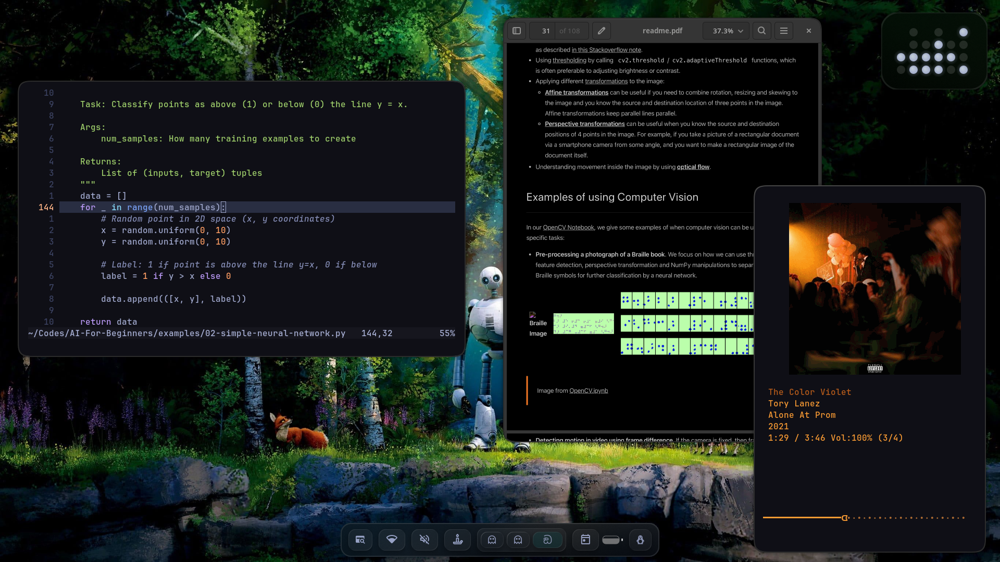
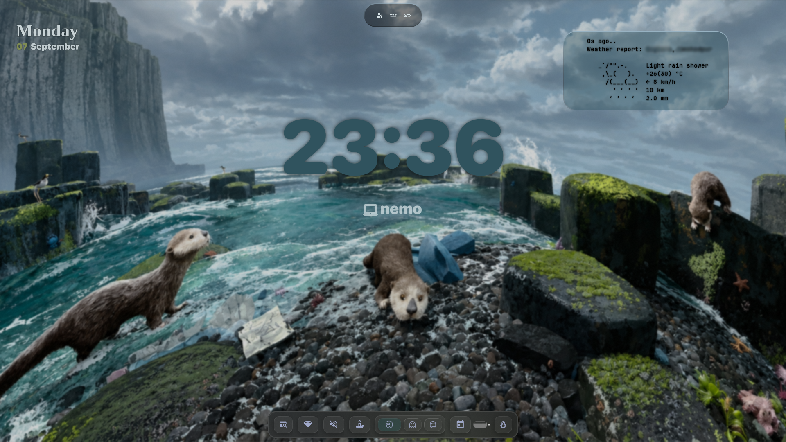

# Arch Library Mode Setup
This is my personal Linux configuration, Hyprland was the core window manager and a bunch of scripts I wrote to keep my machine running efficiently and silently.

### Hyprland
| Clean Desktop | Applications all over|
|-----|---------|
|  |  |

### Lock Screen


<hr>

#### INSTALL
```sh
curl https://raw.githubusercontent.com/ashudevcodes/dotfiles/hyprland/install.sh | bash

#or
cd dotfiles
./install.sh --offline
```
### The Backstory
I use an HP Pavilion Gaming Laptop Shadow Black Chrome Purple Edition (that's why I call it Dragon), but I hate two things:

1. **Fan Noise:** If my laptop sounds like a jet engine, I can't think.
2. **Bloat:** I’m running on single-channel RAM, so I can't afford to waste memory on Electron apps or background services I don't need.

> My goal is simple: **Minimum RAM consumption, Zero Decibels.**

### What's Inside
* **Light weight WM:** Tiling window manager because dragging windows around is a waste of time.
* **Neovim:** Configured to load instantly.
* **Scripts:** Custom power-management scripts to keep the battery drain remarkably low.

---

### No-Fly List
*Things that are banned on this machine to save RAM:*
- [x] Electron Apps (The devil's RAM eaters)
- [x] Desktop Environments (Too much bloat)
- [x] Happiness (Optional)

---

### 🧘‍♂️ Philosophy
I don't care about high benchmarks. I care about a laptop that stays cool to the touch, lasts all day on battery, and doesn't make a sound even at 2 AM in a dead silent room.

## License
[](https://www.gnu.org/licenses/gpl-3.0)
